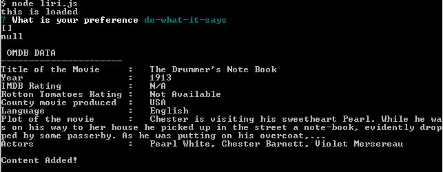

# # LIRI Bot

## APIs

LIRI is like iPhone's SIRI. However, while SIRI is a Speech Interpretation and Recognition Interface, LIRI is a _Language_ Interpretation and Recognition Interface. LIRI will be a command line node app that takes in parameters and gives you back data.

### What it's capable of doing

1. LIRI will display the latest tweets.

2. Spotify data from Spotify API.

3. Movie details from OMDB API.

4. Do What it says - Predefined option

     

### How to Use the app

Use arrow keys and space bar to select the option

 

#### My-tweets :newspaper:

Will show my last 20 tweets.
 
 

#### Spotify data from Spotify API. :notes:

Name a song and it will display song details.

 

#### Movie this. :movie_camera:

This option will give movie details after entering a name of a movie.

 

##### Do What it says :book:

For this option the app search for the conditions in random.txt and provide the response according to that. User has no control over that option.

 

The app will save all the search queries in the log.txt.

Enjoy.. :ferris_wheel: 

      
  

  

